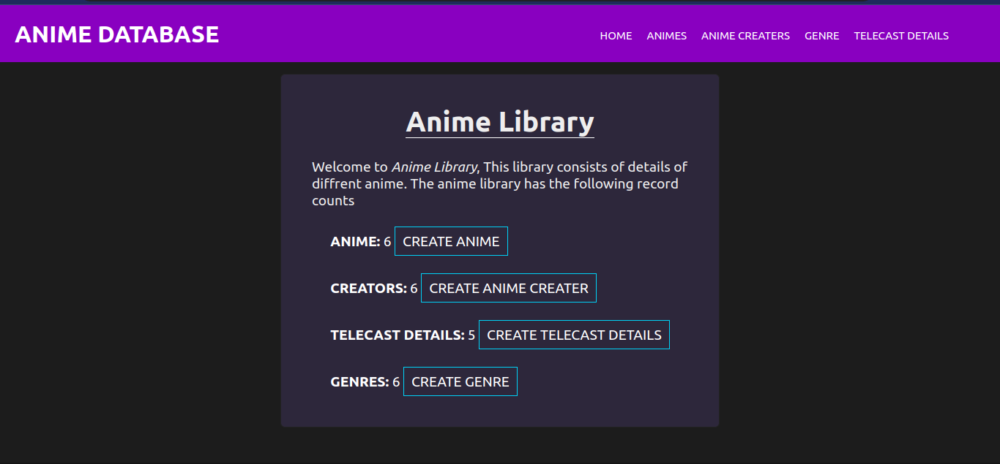

# Inventory Applicaion

Preview -> [Check it out](https://inven-0001.herokuapp.com/catalog)

## Summary :

Inventory applicaion was built using nodejs and express .It helps the user to manage mongodb database and perform CURD operation in the database using model,view and controllers 

## Technologies used:

### Backend:
- Node with Express
- JS
- MongoDB with Mongoose

### Frontend:
- HTML
- CSS
- PUG